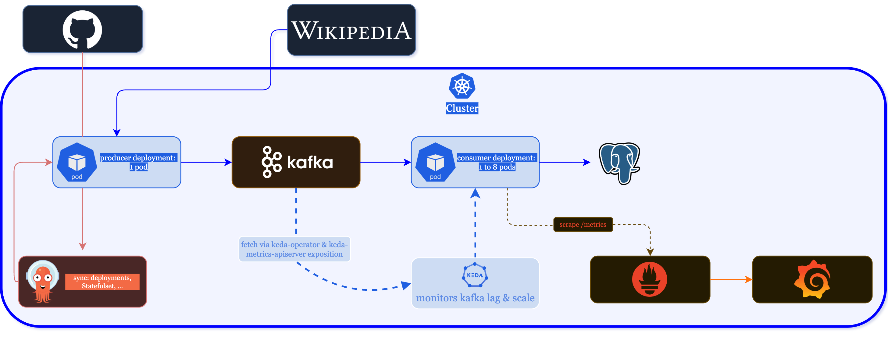
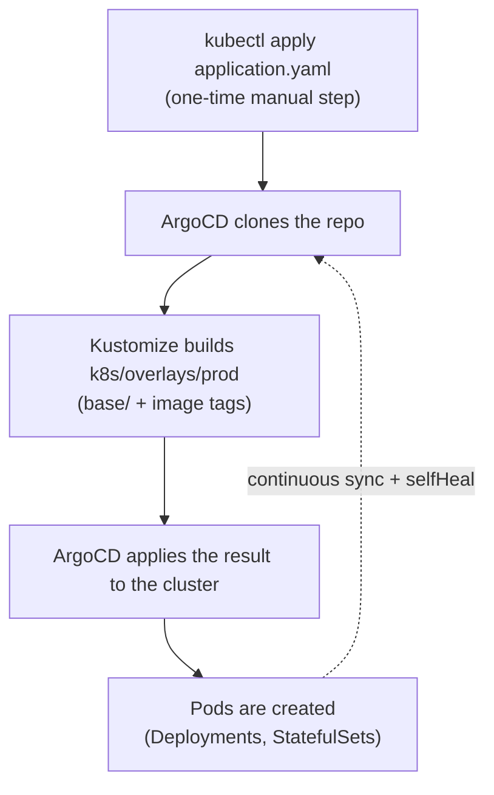
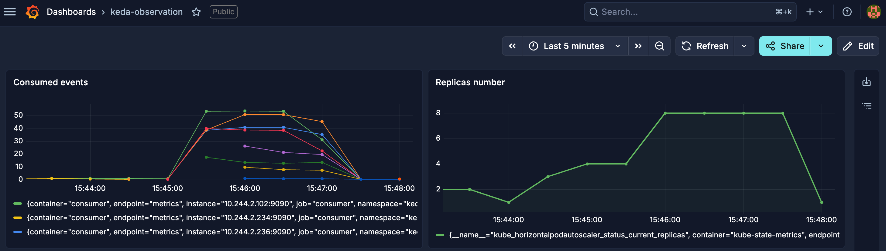
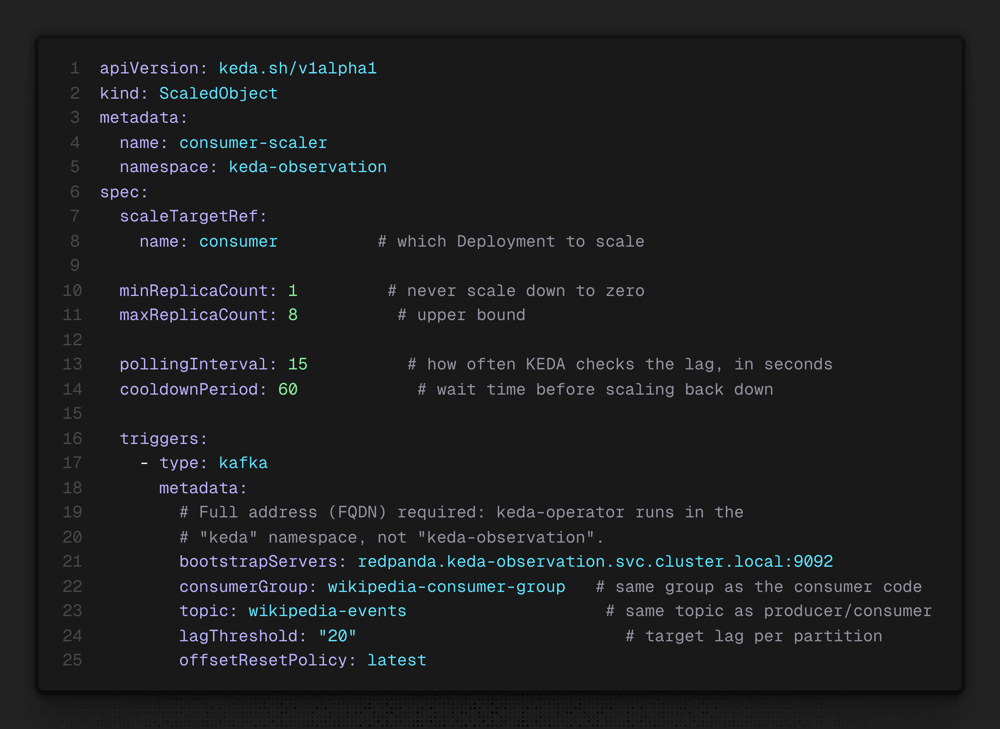

```
 _  __   _____   ____    _
| |/ /  | ____| |  _ \  / \
| ' /   |  _|   | | | |/ _ \
| . \   | |___  | |_| / ___ \
|_|\_\  |_____| |____/_/   \_\

              O B S E R V A T I O N
```

Event-driven streaming pipeline (Wikipedia -> Kafka -> PostgreSQL) with autoscaling driven by real load (KEDA), continuous deployment with GitOps (ArgoCD), and observability (Prometheus/Grafana)


## Table of contents

- [Overview](#overview)
- [Repo structure](#repo-structure)
- [Phase 1: GitOps bootstrap](#phase-1-gitops-bootstrap-done-once)
- [Phase 2: why base/ and overlays/prod/ are separated](#phase-2-why-base-and-overlaysprod-are-separated)
- [Phase 3: data flow](#phase-3-data-flow)
- [Phase 4: how KEDA works here](#phase-4-how-keda-works-here)
- [Phase 5: observability](#phase-5-observability)


## Overview



Everything runs on a kubeadm cluster (3 Hetzner VMs), managed with GitOps through ArgoCD: this repo is the single source of truth, nothing is changed by hand in the cluster.


## Repo structure

```
apps/
├── producer/           Go code: reads Wikipedia, publishes to Kafka
│   ├── main.go
│   ├── go.mod
│   └── Dockerfile
└── consumer/            Go code: reads Kafka, writes to Postgres, exposes /metrics
    ├── main.go
    ├── go.mod
    └── Dockerfile

k8s/
├── base/                 the full definition of the project (everything, no exceptions)
│   ├── kustomization.yaml    lists the 13 files below
│   ├── namespace.yaml
│   ├── redpanda/service.yaml
│   ├── redpanda/statefulset.yaml
│   ├── postgres/secret.yaml
│   ├── postgres/service.yaml
│   ├── postgres/statefulset.yaml
│   ├── producer/configmap.yaml
│   ├── producer/deployment.yaml
│   ├── consumer/configmap.yaml
│   ├── consumer/deployment.yaml
│   ├── consumer/service.yaml
│   ├── keda/scaledobject.yaml
│   └── monitoring/consumer-servicemonitor.yaml
│
└── overlays/prod/
    └── kustomization.yaml    references base/, patches the image tags

argocd/
└── application.yaml      ArgoCD Application object, points to k8s/overlays/prod
```


## Phase 1: GitOps bootstrap (done once)

This is the only manual action in the whole project:

```
kubectl apply -f https://raw.githubusercontent.com/<user>/keda-observation/main/argocd/application.yaml
```



After this, ArgoCD continuously compares the repo to the real cluster state and fixes any drift automatically (`selfHeal: true`).


## Phase 2: why base/ and overlays/prod/ are separated

`base/kustomization.yaml` lists every single object of the project, even the ones with no image at all (namespace, secret, ScaledObject, ServiceMonitor). Its only job is to make sure **everything** exists in the cluster.

`overlays/prod/kustomization.yaml` references all of `base/`, then applies one extra patch, limited to the two image tags. This is the only file the CI will ever touch automatically on deploy (`kustomize edit set image ...`), so the rest of the project is never touched.

ArgoCD points exactly at `k8s/overlays/prod`, never at `k8s/` as a whole: both folders contain their own `kustomization.yaml`, and without a precise entry point ArgoCD would try to treat both as separate sources, producing two competing definitions of the same objects.


## Phase 3: data flow

```
stream.wikimedia.org/v2/stream/recentchange  (public external stream)
        │
        │ HTTP GET request, header Accept: text/event-stream
        │ (consumeStream function, apps/producer/main.go)
        ▼
producer pod (fixed at 1 replica, never scaled — more than one
instance would duplicate the same events into Kafka)
        │
        │ parses each JSON line into a WikiEvent struct
        │ filter: event.Wiki == WIKI_FILTER ("frwiki")
        │ throttle: keeps 1 event out of SAMPLE_RATE (10)
        │ publishes with kafka-go, target KAFKA_BROKERS ("redpanda:9092")
        ▼
redpanda Service (headless, port 9092) → redpanda-0 pod
        │
        │ stores the message in the KAFKA_TOPIC topic ("wikipedia-events")
        ▼
consumer pod (1 to N replicas, driven by KEDA)
        │
        │ reads with kafka-go, GroupID = KAFKA_GROUP_ID
        │ ("wikipedia-consumer-group" — if several consumer pods
        │ share this same GroupID, Kafka automatically splits
        │ the messages between them)
        │
        │ parses the JSON, inserts into Postgres via pool.Exec(...)
        │ connection: DATABASE_URL (postgres-credentials Secret,
        │ injected through env.valueFrom.secretKeyRef)
        ▼
postgres Service (headless, port 5432) → postgres-0 pod
        │
        │ the wiki_events table is created the first time the
        │ consumer starts (ensureSchema function, CREATE TABLE IF NOT EXISTS)
        ▼
Persistent disk (storageClassName local-path), mounted on
/var/lib/postgresql/data — survives pod restarts
```


## Phase 4: how KEDA works here

### Seeing it in action



### The problem KEDA solves

The standard Kubernetes HorizontalPodAutoscaler (HPA) only scales on CPU or memory. That's fine for a web API, but it's a bad fit for a worker reading a queue: a pod can sit at 5% CPU while thousands of messages pile up behind it, and the HPA will never react.

KEDA fixes this by letting the HPA scale on **any external metric** instead — in this project, the Kafka consumer group lag.

### What installing KEDA adds to the cluster

KEDA is installed once, cluster-wide, from its official manifest (not written by this repo). It adds:

- New CRDs (Custom Resource Definitions): `ScaledObject`, `ScaledJob`, `TriggerAuthentication`, `ClusterTriggerAuthentication` — new object types Kubernetes did not know before.
- Three pods: `keda-operator` (watches `ScaledObject` objects and reacts to them), `keda-metrics-apiserver` (exposes the collected metric through a standard Kubernetes API), `keda-admission` (validates new objects).

### Our ScaledObject

The only KEDA-related file that belongs to this repo is `k8s/base/keda/scaledobject.yaml`:



### What happens once this object exists

```
keda-operator sees this new ScaledObject as soon as it's created,
and automatically creates a standard Kubernetes HorizontalPodAutoscaler
named keda-hpa-consumer-scaler
        │
        ▼
Every 15 seconds (pollingInterval):
        │
        │ keda-operator asks Redpanda: what is the current lag
        │ of the wikipedia-consumer-group group?
        │
        │ Redpanda answers a number, say 85
        ▼
keda-operator exposes this number through an external metrics API
        │
        ▼
The HPA (a standard Kubernetes component, not created by this repo)
reads this number and computes:
        replicas = current_lag / lagThreshold = 85 / 20 ≈ 5
        (capped between minReplicaCount and maxReplicaCount)
        │
        ▼
The HPA updates spec.replicas on the consumer Deployment
        │
        ▼
The native Deployment controller creates or removes consumer pods
to reach that number. Each new pod automatically joins the same
Kafka GroupID, which then splits the load across all active pods.
```

Checking the real lag by hand:
```
kubectl exec -it redpanda-0 -n keda-observation -- rpk group describe wikipedia-consumer-group
```

## Phase 5: observability

The consumer container exposes its metrics at `http://localhost:9090/metrics` (`promhttp` package, `apps/consumer/main.go`): `wiki_consumer_events_total`, `wiki_consumer_events_failed_total`, `wiki_consumer_insert_duration_seconds`.

The `consumer` Service (`k8s/base/consumer/service.yaml`) exposes this port under the name `metrics`, with no effect until something actually queries it.

The `ServiceMonitor` object (`k8s/base/monitoring/consumer-servicemonitor.yaml`) carries the label `release: prometheus`, required because the Prometheus instance on this cluster only accepts ServiceMonitors carrying that exact label in its `serviceMonitorSelector`.

```
Prometheus Operator (a separate pod, monitoring namespace, not
Prometheus itself) watches the Kubernetes API at all times
        │
        │ sees the "consumer" ServiceMonitor appear
        │ checks that its release: prometheus label matches what
        │ the Prometheus object (CRD) expects
        ▼
Prometheus Operator generates the matching scrape config,
injects it into a Secret read by Prometheus, then forces a
hot reload (/-/reload endpoint)
        │
        ▼
Prometheus scrapes http://consumer.keda-observation.svc.cluster.local:9090/metrics
every 15 seconds, and keeps the history over time

Prometheus also scrapes kube-state-metrics, which exposes the
state of the keda-hpa-consumer-scaler HPA (current and desired
replica count)
        │
        ▼
Grafana queries Prometheus to build the dashboards: event
throughput, insert latency, and the number of consumer pods
over time, correlated with the Kafka lag
```
